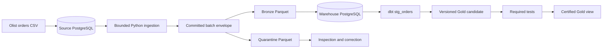

# Local-First E-commerce Data Platform

A portfolio Data Engineering project designed to demonstrate reliable incremental ingestion, immutable raw evidence, explicit data contracts, quality isolation, dbt modeling, and failure recovery without paid infrastructure.

## Current status

> **Start here:** [`docs/CURRENT_STATE.md`](docs/CURRENT_STATE.md) — current state, invariants, open decisions, and task-specific reading map for any agent or contributor.

For the authoritative current phase, completed slices, implementation authorization, and
next work, see [`docs/CURRENT_STATE.md`](docs/CURRENT_STATE.md). This README intentionally
does not duplicate mutable progress metadata.

Phase 1 delivers: Docker Compose with source + warehouse PostgreSQL, deterministic Olist
bootstrap (99,441 orders), bounded `(source_updated_at, order_id)` extraction, Parquet
committed batches with manifest + quarantine envelope, crash recovery, idempotent
warehouse load, dbt `stg_orders`, versioned Gold candidate with certified-view promotion,
and `gold.mart_daily_order_fulfillment` (one row per Chilean purchase-date cohort).

Verified reconciliation: source 99,442 = silver 99,442 = gold 99,442
(99,441 Olist + 1 deterministic demo mutation).

Phase 2A adds `order_items` ingestion with a composite cursor key (ADR-006), both
incremental and backfill extraction, and a BRL-only `gold.mart_daily_commerce` (GMV,
freight, AOV; ADR-005), with the same failure-injection test coverage as orders and a
blocking no-orphan-items invariant (GOLD-COM-ORPHAN-001). Phase 2B adds `order_payments`
ingestion with a payment-reconciliation diagnostic model (`int_payment_reconciliation`,
never a GMV input) and a deterministic synthetic refund generator
(`ecom.generate_refunds`, parallel to `ecom.mutate`) feeding `gold.mart_daily_refunds`
(grained by refund date, never netted into `gmv_brl`). Phase 2C slice 1 adds `products`
and `sellers` as simple-key dimensions (ADR-008, reusing ADR-002 unchanged) and
`gold.mart_daily_category_commerce`, breaking BRL commerce value down by product category
at item grain; its total reconciles exactly to `mart_daily_commerce.gmv_brl` per date.
Phase 2C slice 2 adds `customers` as a dimension and exposes the `customer_id` vs
`customer_unique_id` distinction (SDD §9.4), with no new metric defined on it yet — that
remains deferred pending its own ADR. Phase 2D implements ADR-007's BRL->CLP design for
`mart_daily_commerce.gmv_clp`: `ecom.fetch_fx_rates` pulls BCB PTAX and SII Dolar
Observado rates for a bounded date range, and `silver.int_fx_cross_rate` resolves a
7-day-carry-forward cross-rate per date, failing the build closed when a date cannot
resolve. Verified locally end-to-end against synthetic fixtures; not yet run against the
full Olist dataset.

Phase 1 closure evidence is in [`docs/evidence/phase1-closure.md`](docs/evidence/phase1-closure.md).
Phase 1.1 hardening evidence is in
[`docs/evidence/phase1_1-closure.md`](docs/evidence/phase1_1-closure.md).
Phase 2A closure evidence is in
[`docs/evidence/phase2a-closure.md`](docs/evidence/phase2a-closure.md).
Phase 2B closure evidence is in
[`docs/evidence/phase2b-closure.md`](docs/evidence/phase2b-closure.md).
Phase 2C slice 1 closure evidence is in
[`docs/evidence/phase2c-closure.md`](docs/evidence/phase2c-closure.md).
Phase 2C slice 2 closure evidence is in
[`docs/evidence/phase2c-slice2-closure.md`](docs/evidence/phase2c-slice2-closure.md).
Phase 2D closure evidence is in
[`docs/evidence/phase2d-closure.md`](docs/evidence/phase2d-closure.md).

## Business problem

An e-commerce operational system should not also serve analytical workloads. This project creates a reproducible boundary that incrementally extracts operational changes, preserves source evidence, isolates invalid records, builds reusable analytical models, and publishes tested business metrics.

Phase 1 will answer fulfillment questions such as:

- How many orders were purchased each day?
- How many purchased orders were delivered or canceled?
- How frequently were valid delivered orders late?
- How long did valid delivery take?
- How many orders contain known fulfillment-quality issues?

## Phase 1 architecture



The first certified product will be `mart_daily_order_fulfillment`, with one row per Chilean purchase-date cohort.

## Source data

The historical source is the [Brazilian E-Commerce Public Dataset by Olist](https://www.kaggle.com/datasets/olistbr/brazilian-ecommerce), reported by Kaggle under CC BY-NC-SA 4.0.

The reviewed local copy contains nine files, 126,186,995 bytes, and 1,550,922 logical CSV records. Exact file sizes, headers, row counts, and SHA-256 values are recorded in [`data/manifest.json`](data/manifest.json).

Raw CSV files are intentionally excluded from Git. To review the same source locally, obtain the dataset under its license and place its nine CSV files in `dataset/`. Do not rename source columns.

## License

Project code is released under the [MIT License](LICENSE). The Olist dataset itself is
**not** included in this repository and remains under its original CC BY-NC-SA 4.0 terms;
obtain it directly from Kaggle under that license.

## Brazil source and Chile reporting

The project does not relabel Brazilian values as Chilean data.

- Historical monetary values remain source-currency BRL.
- Naive historical timestamps are interpreted under the documented `America/Sao_Paulo` assumption.
- Canonical instants are stored in UTC.
- Consumer reporting dates use `America/Santiago`.
- CLP reporting (ADR-007) is implemented for `mart_daily_commerce.gmv_clp` only; every
  other mart and column remains BRL-only until its own additive follow-up.

Phase 1 contains no monetary metrics.

## Key engineering guarantees

- Cursor ordering uses `(source_updated_at, order_id)`.
- Extraction windows are lower-exclusive and upper-inclusive.
- The upper cursor is fixed from one stable source snapshot.
- A checkpoint advances only after all extracted rows are durably accounted for.
- Filesystem and PostgreSQL commits use deterministic recovery rather than a false cross-system atomicity claim.
- Reprocessing converges without duplicate canonical facts.
- Invalid records are retained in quarantine rather than silently dropped.
- Failed Gold candidates do not replace the last certified output.
- The system claims at-least-once processing with idempotent convergence, not exactly-once delivery.

## Documentation map

| Artifact | Purpose | Status |
|---|---|---|
| [`docs/CURRENT_STATE.md`](docs/CURRENT_STATE.md) | Agent/contributor entry point: state, invariants, routing | Current |
| [`SDD.md`](SDD.md) | Canonical project-specific source of truth | Accepted |
| [`Archived SDD v1`](docs/archive/SDD_v1.md) | Original design retained for history | Superseded |
| [`ARCHITECTURE_BIBLE.md`](ARCHITECTURE_BIBLE.md) | General architecture principles | Living guidance |
| [`AGENTS.md`](AGENTS.md) | Repository operating rules | Active |
| [`ADR-001`](docs/adrs/ADR-001-local-topology.md) | Local source and warehouse topology | Accepted |
| [`ADR-002`](docs/adrs/ADR-002-incremental-commit-protocol.md) | Cursor, commit, checkpoint, and recovery | Accepted |
| [`ADR-003`](docs/adrs/ADR-003-contract-quality-quarantine.md) | Contracts, quality, and quarantine | Accepted |
| [`ADR-004`](docs/adrs/ADR-004-fulfillment-mart.md) | Gold grain, metrics, and publication | Accepted |
| [`ADR-005`](docs/adrs/ADR-005-commerce-metrics.md) | GMV, AOV, freight, cancellations, refunds | Accepted |
| [`ADR-006`](docs/adrs/ADR-006-composite-entity-cursor.md) | Composite-key cursor for `order_items` | Accepted |
| [`ADR-007`](docs/adrs/ADR-007-fx-brl-clp.md) | BRL-to-CLP FX source and conversion policy | Accepted (implemented for gmv_clp) |
| [`ADR-008`](docs/adrs/ADR-008-category-seller-dimensions.md) | Products/sellers dimensions and category commerce mart | Accepted |
| [`Metric glossary`](docs/metrics.md) | Canonical certified-mart metric semantics | Accepted |
| [`Test matrix`](docs/testing/phase1-test-matrix.md) | Required Phase 1 verification | Accepted |
| [`Phase 1 closure evidence`](docs/evidence/phase1-closure.md) | Acceptance results and layer reconciliation | Closed |
| [`Phase 1.1 closure evidence`](docs/evidence/phase1_1-closure.md) | Design-alignment hardening results | Closed |
| [`Phase 2A closure evidence`](docs/evidence/phase2a-closure.md) | Order items + BRL commerce results | Closed |
| [`Phase 2B closure evidence`](docs/evidence/phase2b-closure.md) | Order payments ingestion + synthetic refunds results | Closed |
| [`Phase 2B payments evidence (historical)`](docs/evidence/phase2b-payments-closure.md) | Intermediate payments-only closure, superseded above | Historical |
| [`Historical progress report`](docs/evidence/progress-report.md) | Snapshot at Phase 1.1 closure | Historical |
| [`Phase 1 implementation guide`](docs/phase1-implementation-guide.md) | Historical Phase 1/1.1 implementation snapshot | Historical |
| [`Olist bootstrap contract`](contracts/source/olist_orders.v1.yaml) | Historical CSV boundary | Accepted |
| [`Operational orders contract`](contracts/source/operational_orders.v1.yaml) | Incremental PostgreSQL boundary | Accepted |
| [`Gold contract`](contracts/gold/mart_daily_order_fulfillment.v1.yaml) | Certified consumer product | Accepted |
| [`Olist order_items contract`](contracts/source/olist_order_items.v1.yaml) | Historical CSV boundary (Phase 2A) | Accepted |
| [`Operational order_items contract`](contracts/source/operational_order_items.v1.yaml) | Incremental PostgreSQL boundary (Phase 2A) | Accepted |
| [`Commerce Gold contract`](contracts/gold/mart_daily_commerce.v1.yaml) | Certified BRL commerce product (Phase 2A) | Accepted |
| [`Olist order_payments contract`](contracts/source/olist_order_payments.v1.yaml) | Historical CSV boundary (Phase 2B) | Accepted |
| [`Operational order_payments contract`](contracts/source/operational_order_payments.v1.yaml) | Incremental PostgreSQL boundary (Phase 2B) | Accepted |
| [`Operational order_refunds contract`](contracts/source/operational_order_refunds.v1.yaml) | Synthetic refund events boundary (Phase 2B) | Accepted |
| [`Refunds Gold contract`](contracts/gold/mart_daily_refunds.v1.yaml) | Certified synthetic refund product (Phase 2B) | Accepted |
| [`Olist products contract`](contracts/source/olist_products.v1.yaml) | Historical CSV boundary (Phase 2C) | Accepted |
| [`Operational products contract`](contracts/source/operational_products.v1.yaml) | Incremental PostgreSQL boundary (Phase 2C) | Accepted |
| [`Olist sellers contract`](contracts/source/olist_sellers.v1.yaml) | Historical CSV boundary (Phase 2C) | Accepted |
| [`Operational sellers contract`](contracts/source/operational_sellers.v1.yaml) | Incremental PostgreSQL boundary (Phase 2C) | Accepted |
| [`Category commerce Gold contract`](contracts/gold/mart_daily_category_commerce.v1.yaml) | Certified BRL category breakdown (Phase 2C) | Accepted |
| [`Phase 2C slice 1 closure evidence`](docs/evidence/phase2c-closure.md) | Products/sellers + category commerce results | Closed |
| [`Olist customers contract`](contracts/source/olist_customers.v1.yaml) | Historical CSV boundary (Phase 2C slice 2) | Accepted |
| [`Operational customers contract`](contracts/source/operational_customers.v1.yaml) | Incremental PostgreSQL boundary (Phase 2C slice 2) | Accepted |
| [`Phase 2C slice 2 closure evidence`](docs/evidence/phase2c-slice2-closure.md) | Customers dimension ingestion results | Closed |
| [`FX usd_brl rate contract`](contracts/source/fx_rate_usd_brl.v1.yaml) | External BCB PTAX reference boundary (Phase 2D) | Accepted |
| [`FX usd_clp rate contract`](contracts/source/fx_rate_usd_clp.v1.yaml) | External SII Dolar Observado reference boundary (Phase 2D) | Accepted |
| [`Phase 2D closure evidence`](docs/evidence/phase2d-closure.md) | gmv_clp implementation + fail-closed verification | Closed |

## Deliberate scope

Phase 1 contains one complete orders vertical slice. Phase 2A adds `order_items` + BRL
GMV/AOV. Phase 2B adds `order_payments` + synthetic refunds. Phase 2C adds
`products`/`sellers`/`customers` dimensions + category commerce breakdown. All
deliberately exclude:

- any new-vs-returning-customer metric (`customers` is ingested and the `customer_id`
  vs `customer_unique_id` distinction is exposed, but no metric is defined on it — that
  requires its own ADR, SDD §37);
- any seller-grained Gold metric (`sellers` is ingested but not yet consumed by one);
- a true net-of-refund GMV/revenue figure (ADR-005: `mart_daily_commerce.gmv_brl` is
  never netted against `mart_daily_refunds`; a reader computes any net view explicitly);
- CLP beyond `mart_daily_commerce.gmv_clp` (Phase 2D, ADR-007; freight/gross/AOV in CLP
  and CLP on the category/refunds marts are additive follow-ups, not yet implemented);
- Airflow;
- dashboarding;
- cloud infrastructure;
- CDC and streaming;
- Spark and distributed processing;
- agent or MCP access.

These technologies and entities are introduced only when a later requirement justifies them.

## Phase 0 completion

Phase 0 was accepted by Juan Pablo on 2026-09-06 after:

- the four ADRs, contracts, metrics, and test matrix are reviewed;
- the dataset manifest is validated;
- the design package has no implementation-blocking contradictions;
- Juan Pablo explicitly approved the package;
- all Phase 0 artifacts were marked `Accepted` with the approval date;
- the original SDD was archived;
- the accepted V2 content was promoted to canonical `SDD.md`.

## Phase 1 runbook

Prerequisites: Docker Desktop running, `cp -n .env.example .env`, Python 3.12 + `uv`.

```bash
uv sync --extra dev
docker compose up -d
set -a; source .env; set +a
uv run python -m ecom.bootstrap --csv dataset/olist_orders_dataset.csv --attempt-id boot-001
scripts/create_source_reader.sh
uv run python -m ecom.extract
uv run python -m ecom.load
uv run python -m ecom.mutate --ts 2018-10-21T00:00:00+00:00
uv run python -m ecom.extract
uv run python -m ecom.load
cd dbt && PUBLICATION_ID=phase1 uv run --project .. dbt build --profiles-dir . && cd ..
uv run python -m ecom.publish --publication-id phase1 --test-results dbt/target/run_results.json --dbt-manifest dbt/target/manifest.json
uv run python -m ecom.retention
uv run --extra dev pytest tests/
uv run --extra dev ruff check src tests
```

Demonstrated behaviors: initial + incremental runs, idempotent rerun (`no_op`),
crash-after-publish recovery reusing one committed batch, bootstrap structural failure,
row quarantine below threshold, failed Gold publication preserving the certified view,
and source = silver = gold reconciliation.

The default bootstrap command validates the pinned CSV checksum in `data/manifest.json`.
`--allow-unverified-input` is reserved for deterministic synthetic fixtures in tests.

## Phase 2A runbook (order items + BRL commerce)

Run after the Phase 1 runbook above, against the same running stack:

```bash
uv run python -m ecom.bootstrap_items --csv dataset/olist_order_items_dataset.csv --attempt-id boot-items-001
uv run python -m ecom.extract_items
uv run python -m ecom.load_items
cd dbt && PUBLICATION_ID=phase2a uv run --project .. dbt build --profiles-dir . && cd ..
uv run python -m ecom.publish --product mart_daily_commerce --publication-id phase2a --test-results dbt/target/run_results.json --dbt-manifest dbt/target/manifest.json
```

`gold.mart_daily_commerce` is then queryable alongside `gold.mart_daily_order_fulfillment`.
See [ADR-005](docs/adrs/ADR-005-commerce-metrics.md) for the GMV/AOV definitions and
[ADR-006](docs/adrs/ADR-006-composite-entity-cursor.md) for the `order_items` cursor.

## Phase 2B runbook (order payments + synthetic refunds)

Run after the Phase 2A runbook above, against the same running stack:

```bash
uv run python -m ecom.bootstrap_payments --csv dataset/olist_order_payments_dataset.csv --attempt-id boot-pay-001
uv run python -m ecom.extract_payments
uv run python -m ecom.load_payments
uv run python -m ecom.generate_refunds --ts 2018-10-22T00:00:00+00:00
uv run python -m ecom.extract_refunds
uv run python -m ecom.load_refunds
cd dbt && PUBLICATION_ID=phase2b uv run --project .. dbt build --profiles-dir . && cd ..
uv run python -m ecom.publish --product mart_daily_refunds --publication-id phase2b --test-results dbt/target/run_results.json --dbt-manifest dbt/target/manifest.json
```

`silver.int_payment_reconciliation` is a diagnostic-only model (never a GMV input).
`ecom.generate_refunds` is entirely synthetic (ADR-005) — Olist has no refund signal; by
default it refunds the lexicographically first unrefunded payment, or target one
explicitly with `--order-id`/`--payment-sequential`. `gold.mart_daily_refunds` is grained
by refund date and is never netted into `mart_daily_commerce.gmv_brl`.

## Phase 2C slice 1 runbook (products + sellers + category commerce)

Run after the Phase 2A runbook above, against the same running stack:

```bash
uv run python -m ecom.bootstrap_products --csv dataset/olist_products_dataset.csv --attempt-id boot-prod-001
uv run python -m ecom.extract_products
uv run python -m ecom.load_products
uv run python -m ecom.bootstrap_sellers --csv dataset/olist_sellers_dataset.csv --attempt-id boot-sell-001
uv run python -m ecom.extract_sellers
uv run python -m ecom.load_sellers
cd dbt && uv run --project .. dbt seed --profiles-dir .
PUBLICATION_ID=phase2c uv run --project .. dbt build --profiles-dir . && cd ..
uv run python -m ecom.publish --product mart_daily_category_commerce --publication-id phase2c --test-results dbt/target/run_results.json --dbt-manifest dbt/target/manifest.json
```

`dbt seed` loads the static `product_category_name_translation` reference table (ADR-008
— not ingested through bootstrap/extract/load, since it has no natural key mutation).
`gold.mart_daily_category_commerce` breaks BRL commerce value down by product category at
item grain, reapplying ADR-005's eligibility rules; `sum(category_gmv_brl)` by date
reconciles exactly to `mart_daily_commerce.gmv_brl`. Any seller-grained Gold metric
remains out of scope (ADR-008 "Deferred").

## Phase 2C slice 2 runbook (customers dimension)

Run after (or alongside) the Phase 1 runbook above, against the same running stack —
`customers` is tightly coupled 1:1 with `orders`, so it should be bootstrapped right after
it:

```bash
uv run python -m ecom.bootstrap_customers --csv dataset/olist_customers_dataset.csv --attempt-id boot-cust-001
uv run python -m ecom.extract_customers
uv run python -m ecom.load_customers
```

`silver.stg_customers` exposes both `customer_id` (order-associated row) and
`customer_unique_id` (repeat-customer identity, SDD §9.4). No metric is defined on
`customer_unique_id` in this slice; that is deferred pending its own ADR.

## Phase 2D runbook (BRL->CLP FX, gmv_clp)

Run after the Phase 2A runbook above, against the same running stack:

```bash
uv run python -m ecom.fetch_fx_rates --from-date 2016-01-01 --to-date 2018-12-31
# or, without live network access:
uv run python -m ecom.fetch_fx_rates --from-date 2017-01-01 --to-date 2018-02-01 --fixture-dir tests/fixtures/fx
cd dbt && uv run --project .. dbt seed --profiles-dir .
PUBLICATION_ID=phase2d uv run --project .. dbt build --profiles-dir . && cd ..
uv run python -m ecom.publish --product mart_daily_commerce --publication-id phase2d --test-results dbt/target/run_results.json --dbt-manifest dbt/target/manifest.json
```

`ecom.fetch_fx_rates` pulls BCB PTAX (BRL leg) and SII Dolar Observado (CLP leg) for the
requested range and upserts them into `raw_stage.fx_rate_usd_brl`/`fx_rate_usd_clp` (no
network call with `--fixture-dir`). `silver.int_fx_cross_rate` resolves a BRL/CLP
cross-rate per `mart_daily_commerce` cohort date, carrying forward up to 7 calendar days
per leg; a date that cannot resolve on either leg fails the dbt build closed
(`assert_fx_rate_resolves_for_commerce_dates`), per ADR-007.

## Continuous integration

Every pull request and push to `main` runs
[`.github/workflows/ci.yml`](.github/workflows/ci.yml): Ruff lint and format checks, unit
tests, then a full pipeline cycle (bootstrap orders+customers, extract+load orders,
extract+load customers, fetch FX rates, dbt seed, dbt build, publish all four Gold
products, integration tests — including the
`order_items`/`order_payments`/`order_refunds`/`products`/`sellers`/`customers`/FX
vertical slices — and final reconciliation) against two ephemeral PostgreSQL containers
using the repository's `compose.yaml`. `customers` bootstraps alongside `orders` as an
explicit CI step (not inside pytest) because it is tightly coupled 1:1 with orders; see
`docs/CURRENT_STATE.md` §6a for why. `ecom.fetch_fx_rates` always runs with
`--fixture-dir tests/fixtures/fx` in CI — the live BCB/SII sources are never called by
any automated test. CI bootstraps from small synthetic fixtures
(`tests/fixtures/orders_small.csv`, `tests/fixtures/order_items_small.csv`,
`tests/fixtures/order_payments_small.csv`, `tests/fixtures/products_small.csv`,
`tests/fixtures/sellers_small.csv`, `tests/fixtures/customers_small.csv`,
`tests/fixtures/fx/usd_brl.csv`, `tests/fixtures/fx/usd_clp.csv`), never the full Olist
CSVs or the live FX endpoints.

## Next steps

See [`docs/CURRENT_STATE.md`](docs/CURRENT_STATE.md) for the authoritative next slice and
its entry conditions.
