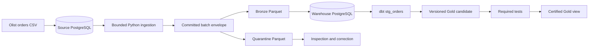

# Local-First E-commerce Data Platform

A portfolio Data Engineering project designed to demonstrate reliable incremental ingestion, immutable raw evidence, explicit data contracts, quality isolation, dbt modeling, and failure recovery without paid infrastructure.

## Current status

> **Start here:** [`docs/CURRENT_STATE.md`](docs/CURRENT_STATE.md) — current state, invariants, open decisions, and task-specific reading map for any agent or contributor.

**Phase:** Phase 1.1 closed (orders fulfillment); Phase 2A implemented locally (order
items + BRL commerce mart), not yet closed
**Design status:** Accepted on 2026-09-06; Phase 2A design (ADR-005/006/007) accepted on 2026-10-04
**Implementation status:** Phase 1 accepted on 2026-09-07; Phase 1.1 closed locally on 2026-09-08
**Implementation authorization:** Phase 1 authorized; Phase 2A implementation underway

Phase 1 delivers: Docker Compose with source + warehouse PostgreSQL, deterministic Olist
bootstrap (99,441 orders), bounded `(source_updated_at, order_id)` extraction, Parquet
committed batches with manifest + quarantine envelope, crash recovery, idempotent
warehouse load, dbt `stg_orders`, versioned Gold candidate with certified-view promotion,
and `gold.mart_daily_order_fulfillment` (one row per Chilean purchase-date cohort).

Verified reconciliation: source 99,442 = silver 99,442 = gold 99,442
(99,441 Olist + 1 deterministic demo mutation).

Phase 2A adds `order_items` ingestion with a composite cursor key (ADR-006) and a BRL-only
`gold.mart_daily_commerce` (GMV, freight, AOV; ADR-005). Verified locally end-to-end
against synthetic fixtures; not yet run against the full Olist dataset or given a
closure-evidence document. See [`docs/CURRENT_STATE.md`](docs/CURRENT_STATE.md) §7a.

Phase 1 closure evidence is in [`docs/evidence/phase1-closure.md`](docs/evidence/phase1-closure.md).
Phase 1.1 hardening evidence is in
[`docs/evidence/phase1_1-closure.md`](docs/evidence/phase1_1-closure.md).

## Business problem

An e-commerce operational system should not also serve analytical workloads. This project creates a reproducible boundary that incrementally extracts operational changes, preserves source evidence, isolates invalid records, builds reusable analytical models, and publishes tested business metrics.

Phase 1 will answer fulfillment questions such as:

- How many orders were purchased each day?
- How many purchased orders were delivered or canceled?
- How frequently were valid delivered orders late?
- How long did valid delivery take?
- How many orders contain known fulfillment-quality issues?

## Phase 1 architecture



The first certified product will be `mart_daily_order_fulfillment`, with one row per Chilean purchase-date cohort.

## Source data

The historical source is the [Brazilian E-Commerce Public Dataset by Olist](https://www.kaggle.com/datasets/olistbr/brazilian-ecommerce), reported by Kaggle under CC BY-NC-SA 4.0.

The reviewed local copy contains nine files, 126,186,995 bytes, and 1,550,922 logical CSV records. Exact file sizes, headers, row counts, and SHA-256 values are recorded in [`data/manifest.json`](data/manifest.json).

Raw CSV files are intentionally excluded from Git. To review the same source locally, obtain the dataset under its license and place its nine CSV files in `dataset/`. Do not rename source columns.

## License

Project code is released under the [MIT License](LICENSE). The Olist dataset itself is
**not** included in this repository and remains under its original CC BY-NC-SA 4.0 terms;
obtain it directly from Kaggle under that license.

## Brazil source and Chile reporting

The project does not relabel Brazilian values as Chilean data.

- Historical monetary values remain source-currency BRL.
- Naive historical timestamps are interpreted under the documented `America/Sao_Paulo` assumption.
- Canonical instants are stored in UTC.
- Consumer reporting dates use `America/Santiago`.
- Monetary reporting in CLP begins in Phase 2 only after an authoritative historical FX source and conversion policy are accepted.

Phase 1 contains no monetary metrics.

## Key engineering guarantees

- Cursor ordering uses `(source_updated_at, order_id)`.
- Extraction windows are lower-exclusive and upper-inclusive.
- The upper cursor is fixed from one stable source snapshot.
- A checkpoint advances only after all extracted rows are durably accounted for.
- Filesystem and PostgreSQL commits use deterministic recovery rather than a false cross-system atomicity claim.
- Reprocessing converges without duplicate canonical facts.
- Invalid records are retained in quarantine rather than silently dropped.
- Failed Gold candidates do not replace the last certified output.
- The system claims at-least-once processing with idempotent convergence, not exactly-once delivery.

## Documentation map

| Artifact | Purpose | Status |
|---|---|---|
| [`docs/CURRENT_STATE.md`](docs/CURRENT_STATE.md) | Agent/contributor entry point: state, invariants, routing | Current |
| [`SDD.md`](SDD.md) | Canonical project-specific source of truth | Accepted |
| [`Archived SDD v1`](docs/archive/SDD_v1.md) | Original design retained for history | Superseded |
| [`ARCHITECTURE_BIBLE.md`](ARCHITECTURE_BIBLE.md) | General architecture principles | Living guidance |
| [`AGENTS.md`](AGENTS.md) | Repository operating rules | Active |
| [`ADR-001`](docs/adrs/ADR-001-local-topology.md) | Local source and warehouse topology | Accepted |
| [`ADR-002`](docs/adrs/ADR-002-incremental-commit-protocol.md) | Cursor, commit, checkpoint, and recovery | Accepted |
| [`ADR-003`](docs/adrs/ADR-003-contract-quality-quarantine.md) | Contracts, quality, and quarantine | Accepted |
| [`ADR-004`](docs/adrs/ADR-004-fulfillment-mart.md) | Gold grain, metrics, and publication | Accepted |
| [`ADR-005`](docs/adrs/ADR-005-commerce-metrics.md) | GMV, AOV, freight, cancellations, refunds | Accepted |
| [`ADR-006`](docs/adrs/ADR-006-composite-entity-cursor.md) | Composite-key cursor for `order_items` | Accepted |
| [`ADR-007`](docs/adrs/ADR-007-fx-brl-clp.md) | BRL-to-CLP FX source and conversion policy | Accepted (design; CLP implementation deferred) |
| [`Metric glossary`](docs/metrics.md) | Canonical Phase 1 metric semantics | Accepted |
| [`Test matrix`](docs/testing/phase1-test-matrix.md) | Required Phase 1 verification | Accepted |
| [`Phase 1 closure evidence`](docs/evidence/phase1-closure.md) | Acceptance results and layer reconciliation | Closed |
| [`Phase 1.1 closure evidence`](docs/evidence/phase1_1-closure.md) | Design-alignment hardening results | Closed |
| [`Progress report`](docs/evidence/progress-report.md) | Current phase, verification, and next-phase gates | Current |
| [`Phase 1 implementation guide`](docs/phase1-implementation-guide.md) | Current code, decisions, evidence, and alignment status | Current |
| [`Olist bootstrap contract`](contracts/source/olist_orders.v1.yaml) | Historical CSV boundary | Accepted |
| [`Operational orders contract`](contracts/source/operational_orders.v1.yaml) | Incremental PostgreSQL boundary | Accepted |
| [`Gold contract`](contracts/gold/mart_daily_order_fulfillment.v1.yaml) | Certified consumer product | Accepted |
| [`Olist order_items contract`](contracts/source/olist_order_items.v1.yaml) | Historical CSV boundary (Phase 2A) | Accepted |
| [`Operational order_items contract`](contracts/source/operational_order_items.v1.yaml) | Incremental PostgreSQL boundary (Phase 2A) | Accepted |
| [`Commerce Gold contract`](contracts/gold/mart_daily_commerce.v1.yaml) | Certified BRL commerce product (Phase 2A) | Accepted |

## Deliberate scope

Phase 1 contains one complete orders vertical slice. Phase 2A adds one more
(`order_items` + BRL GMV/AOV). Both deliberately exclude:

- payments, customers, products, and sellers (Phase 2B/2C);
- synthetic refunds and net-of-refund metrics (Phase 2B, ADR-005);
- BRL->CLP conversion (Phase 2D, ADR-007 design accepted, not implemented);
- Airflow;
- dashboarding;
- cloud infrastructure;
- CDC and streaming;
- Spark and distributed processing;
- agent or MCP access.

These technologies and entities are introduced only when a later requirement justifies them.

## Phase 0 completion

Phase 0 was accepted by Juan Pablo on 2026-09-06 after:

- the four ADRs, contracts, metrics, and test matrix are reviewed;
- the dataset manifest is validated;
- the design package has no implementation-blocking contradictions;
- Juan Pablo explicitly approved the package;
- all Phase 0 artifacts were marked `Accepted` with the approval date;
- the original SDD was archived;
- the accepted V2 content was promoted to canonical `SDD.md`.

## Phase 1 runbook

Prerequisites: Docker Desktop running, `cp -n .env.example .env`, Python 3.12 + `uv`.

```bash
uv sync --extra dev
docker compose up -d
set -a; source .env; set +a
uv run python -m ecom.bootstrap --csv dataset/olist_orders_dataset.csv --attempt-id boot-001
scripts/create_source_reader.sh
uv run python -m ecom.extract
uv run python -m ecom.load
uv run python -m ecom.mutate --ts 2018-10-21T00:00:00+00:00
uv run python -m ecom.extract
uv run python -m ecom.load
cd dbt && PUBLICATION_ID=phase1 uv run --project .. dbt build --profiles-dir . && cd ..
uv run python -m ecom.publish --publication-id phase1 --test-results dbt/target/run_results.json --dbt-manifest dbt/target/manifest.json
uv run python -m ecom.retention
uv run --extra dev pytest tests/
uv run --extra dev ruff check src tests
```

Demonstrated behaviors: initial + incremental runs, idempotent rerun (`no_op`),
crash-after-publish recovery reusing one committed batch, bootstrap structural failure,
row quarantine below threshold, failed Gold publication preserving the certified view,
and source = silver = gold reconciliation.

The default bootstrap command validates the pinned CSV checksum in `data/manifest.json`.
`--allow-unverified-input` is reserved for deterministic synthetic fixtures in tests.

## Phase 2A runbook (order items + BRL commerce)

Run after the Phase 1 runbook above, against the same running stack:

```bash
uv run python -m ecom.bootstrap_items --csv dataset/olist_order_items_dataset.csv --attempt-id boot-items-001
uv run python -m ecom.extract_items
uv run python -m ecom.load_items
cd dbt && PUBLICATION_ID=phase2a uv run --project .. dbt build --profiles-dir . && cd ..
uv run python -m ecom.publish --product mart_daily_commerce --publication-id phase2a --test-results dbt/target/run_results.json --dbt-manifest dbt/target/manifest.json
```

`gold.mart_daily_commerce` is then queryable alongside `gold.mart_daily_order_fulfillment`.
See [ADR-005](docs/adrs/ADR-005-commerce-metrics.md) for the GMV/AOV definitions and
[ADR-006](docs/adrs/ADR-006-composite-entity-cursor.md) for the `order_items` cursor.

## Continuous integration

Every pull request and push to `main` runs
[`.github/workflows/ci.yml`](.github/workflows/ci.yml): Ruff lint and format checks, unit
tests, then a full pipeline cycle (bootstrap, extract, load, dbt build, publish both Gold
products, integration tests — including the `order_items` vertical slice — and final
reconciliation) against two ephemeral PostgreSQL containers using the repository's
`compose.yaml`. CI bootstraps from small synthetic fixtures
(`tests/fixtures/orders_small.csv`, `tests/fixtures/order_items_small.csv`), never the
full Olist CSVs.

## Next steps

- Keep CI and contract-validation automation local and reproducible.
- Expand to Phase 2 entities (order items + FX-gated CLP reporting).
