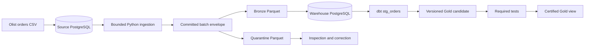

# Local-First E-commerce Data Platform

A portfolio Data Engineering project designed to demonstrate reliable incremental ingestion, immutable raw evidence, explicit data contracts, quality isolation, dbt modeling, and failure recovery without paid infrastructure.

## Current status

**Phase:** Phase 0 complete; Phase 1 not started  
**Design status:** Accepted on 2026-09-06  
**Implementation status:** Not started  
**Implementation authorization:** Phase 1 authorized  

This repository currently contains the design package. It does not yet contain a runnable pipeline, Docker services, Python application, dbt project, or automated tests.

## Business problem

An e-commerce operational system should not also serve analytical workloads. This project creates a reproducible boundary that incrementally extracts operational changes, preserves source evidence, isolates invalid records, builds reusable analytical models, and publishes tested business metrics.

Phase 1 will answer fulfillment questions such as:

- How many orders were purchased each day?
- How many purchased orders were delivered or canceled?
- How frequently were valid delivered orders late?
- How long did valid delivery take?
- How many orders contain known fulfillment-quality issues?

## Phase 1 architecture



The first certified product will be `mart_daily_order_fulfillment`, with one row per Chilean purchase-date cohort.

## Source data

The historical source is the [Brazilian E-Commerce Public Dataset by Olist](https://www.kaggle.com/datasets/olistbr/brazilian-ecommerce), reported by Kaggle under CC BY-NC-SA 4.0.

The reviewed local copy contains nine files, 126,186,995 bytes, and 1,550,922 logical CSV records. Exact file sizes, headers, row counts, and SHA-256 values are recorded in [`data/manifest.json`](data/manifest.json).

Raw CSV files are intentionally excluded from Git. To review the same source locally, obtain the dataset under its license and place its nine CSV files in `dataset/`. Do not rename source columns.

## Brazil source and Chile reporting

The project does not relabel Brazilian values as Chilean data.

- Historical monetary values remain source-currency BRL.
- Naive historical timestamps are interpreted under the documented `America/Sao_Paulo` assumption.
- Canonical instants are stored in UTC.
- Consumer reporting dates use `America/Santiago`.
- Monetary reporting in CLP begins in Phase 2 only after an authoritative historical FX source and conversion policy are accepted.

Phase 1 contains no monetary metrics.

## Key engineering guarantees

- Cursor ordering uses `(source_updated_at, order_id)`.
- Extraction windows are lower-exclusive and upper-inclusive.
- The upper cursor is fixed from one stable source snapshot.
- A checkpoint advances only after all extracted rows are durably accounted for.
- Filesystem and PostgreSQL commits use deterministic recovery rather than a false cross-system atomicity claim.
- Reprocessing converges without duplicate canonical facts.
- Invalid records are retained in quarantine rather than silently dropped.
- Failed Gold candidates do not replace the last certified output.
- The system claims at-least-once processing with idempotent convergence, not exactly-once delivery.

## Documentation map

| Artifact | Purpose | Status |
|---|---|---|
| [`SDD.md`](SDD.md) | Canonical project-specific source of truth | Accepted |
| [`Archived SDD v1`](docs/archive/SDD_v1.md) | Original design retained for history | Superseded |
| [`ARCHITECTURE_BIBLE.md`](ARCHITECTURE_BIBLE.md) | General architecture principles | Living guidance |
| [`AGENTS.md`](AGENTS.md) | Repository operating rules | Active |
| [`ADR-001`](docs/adrs/ADR-001-local-topology.md) | Local source and warehouse topology | Accepted |
| [`ADR-002`](docs/adrs/ADR-002-incremental-commit-protocol.md) | Cursor, commit, checkpoint, and recovery | Accepted |
| [`ADR-003`](docs/adrs/ADR-003-contract-quality-quarantine.md) | Contracts, quality, and quarantine | Accepted |
| [`ADR-004`](docs/adrs/ADR-004-fulfillment-mart.md) | Gold grain, metrics, and publication | Accepted |
| [`Metric glossary`](docs/metrics.md) | Canonical Phase 1 metric semantics | Accepted |
| [`Test matrix`](docs/testing/phase1-test-matrix.md) | Required Phase 1 verification | Accepted |
| [`Olist bootstrap contract`](contracts/source/olist_orders.v1.yaml) | Historical CSV boundary | Accepted |
| [`Operational orders contract`](contracts/source/operational_orders.v1.yaml) | Incremental PostgreSQL boundary | Accepted |
| [`Gold contract`](contracts/gold/mart_daily_order_fulfillment.v1.yaml) | Certified consumer product | Accepted |

## Deliberate scope

Phase 1 contains one complete orders vertical slice. It deliberately excludes:

- GMV and average order value;
- customers, items, payments, products, and sellers;
- Airflow;
- dashboarding;
- cloud infrastructure;
- CDC and streaming;
- Spark and distributed processing;
- agent or MCP access.

These technologies and entities are introduced only when a later requirement justifies them.

## Phase 0 completion

Phase 0 was accepted by Juan Pablo on 2026-09-06 after:

- the four ADRs, contracts, metrics, and test matrix are reviewed;
- the dataset manifest is validated;
- the design package has no implementation-blocking contradictions;
- Juan Pablo explicitly approved the package;
- all Phase 0 artifacts were marked `Accepted` with the approval date;
- the original SDD was archived;
- the accepted V2 content was promoted to canonical `SDD.md`.

Phase 1 is authorized but has not been implemented. This repository must not claim that Phase 1 behavior exists until its acceptance tests pass.

## Planned implementation path

After Phase 0 acceptance, Phase 1 will implement:

```text
Olist orders bootstrap
-> deterministic operational mutations
-> bounded incremental extraction
-> Bronze and quarantine Parquet
-> checkpoint and run metadata
-> idempotent warehouse load
-> dbt Silver
-> tested Gold candidate
-> certified fulfillment mart
```

The exact future run and test commands will be documented only when the corresponding code exists.
